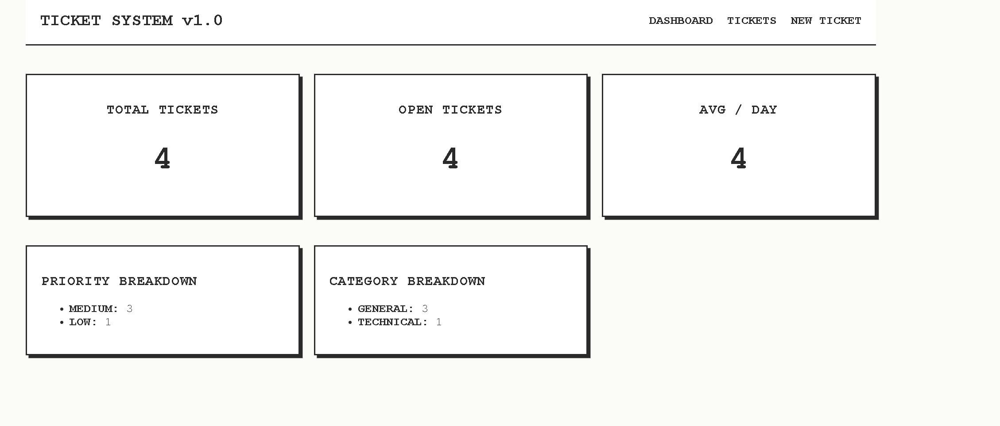

# Support Ticket System

A full-stack support ticket management system I built featuring an AI-powered auto-categorization engine, a custom "Technical Blueprint" user interface, and real-time aggregated metrics. 

## 📸 Screenshots


*Stats Dashboard rendering DB-aggregated metrics.*


*Ticket Creation form with LLM-powered auto-suggestions running in the background.*


*Ticket List with active filtering and search functionality.*

## �️ What I Used (Tech Stack)

I containerized the entire application using **Docker & Docker Compose** to ensure it runs seamlessly in any environment.

* **Backend:** Django, Django REST Framework (DRF), Python
* **Database:** PostgreSQL
* **Frontend:** React, Vite, CSS
* **AI Integration:** Google Gemini 2.5 Flash (`google-genai` SDK)

## ✨ What's In It (Core Features)

1. **AI-Powered Ticket Creation:** When a user types a problem description, the frontend seamlessly pings the backend LLM service. The LLM reads the description and instantly pre-fills the Category and Priority dropdowns. Users can accept these suggestions or override them manually.
2. **Dashboard & Analytics:** A real-time dashboard displaying total tickets, open tickets, average tickets per day, and breakdowns by category/priority.
3. **Advanced Filtering & Search:** A complete ticket browsing interface where users can filter by status and priority, and search via text across titles and descriptions.
4. **Resilient Architecture:** If the LLM API is down or the API key is missing, the system gracefully degrades. Users can still create tickets manually without the app crashing.

## 🧠 Design Decisions & Architecture

I made several specific architectural choices while building this project to prioritize performance and reliability:

* **Database-Level Aggregation:** I avoided using Python `for` loops to calculate the dashboard statistics. Instead, I heavily utilized Django ORM's `aggregate`, `annotate`, and `Count` functions. This pushes the heavy lifting to PostgreSQL, making the `/api/tickets/stats/` endpoint highly performant even with thousands of tickets.
* **Database-Enforced Constraints:** All field constraints (max lengths, category choices, priority levels) are strictly enforced at the PostgreSQL database level, not just in the Django forms or React frontend. This guarantees absolute data integrity.
* **Why Gemini 2.5 Flash?** For the AI integration, I chose Google's Gemini 2.5 Flash. I specifically selected it because of its blazing-fast inference speed (crucial for a fluid UI experience while typing) and its native support for strict JSON-mode outputs. This ensures the backend always receives a perfectly formatted dictionary instead of hallucinated conversational text.
* **UI/UX Theme:** I built a custom "Technical Blueprint" aesthetic using pure CSS. By utilizing monospace fonts, sharp edges, and a high-contrast palette, the application feels like a professional engineering logbook rather than a generic template.

## 🚀 How to Run the Project

1. **Set up the Environment Variable:**
   Create a `.env` file in the root directory of the project and add your Google Gemini API key:
   ```env
   GEMINI_API_KEY=your_api_key_here
   ```

2. **Build and Launch:**
Open your terminal in the root directory and run a single Docker command:
```bash
docker-compose up --build
```


*Note: Docker will automatically apply all Django database migrations during the build process.*
3. **Access the App:**
* **Frontend Interface:** Navigate to `http://localhost:5173`
* **Backend API / Browsable DRF:** Navigate to `http://localhost:8000/api/tickets/`
