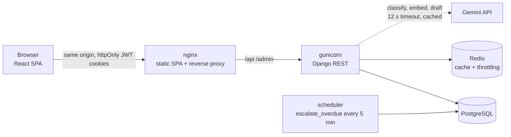

# NexusDesk

**An AI-assisted helpdesk with SLA enforcement, automatic routing and retrieval-grounded reply drafting.**
Django REST · React · PostgreSQL · Redis · Gemini · Docker

[](https://github.com/swatishah946/SupportTicketSystem/actions/workflows/ci.yml)

NexusDesk covers the full life of a support ticket. A customer describes a problem and
is warned if they have already reported it. The ticket is triaged and routed to the
least-busy agent, with an SLA clock running from the moment it is created. The agent
drafts a reply with an AI copilot that cites similar tickets the team has already
solved. Every change is recorded in an audit trail, and anything past its SLA is
escalated automatically.

## Measured results

Every number below is reproducible from this repository. See `backend/evals/` and `backend/benchmarks/`.

| Area | Result | How it was measured |
|---|---|---|
| Tests | **63 tests, 96% line coverage**, green on SQLite and PostgreSQL 16 | `pytest --cov` (CI enforces ≥ 90%) |
| Query efficiency | Ticket list: **2 SQL queries per request at any page size** (was ~6 per ticket: 303 queries for 51 tickets) | query-count regression tests; the "before" figure was measured on the original code |
| API latency (2,000 tickets, PostgreSQL) | list p95 **27 ms**, detail p95 **14 ms**, analytics p95 **24 ms** | `benchmarks/bench_api.py`, in-process, 50 runs each |
| Load test (gunicorn, 3 workers, Postgres and load generator on the same 2 vCPU machine) | 50 concurrent agents, **1,762 requests, 0 errors**, steady-state endpoints p95 **28–40 ms** | Locust, 60 s (`benchmarks/loadtest-stats.csv`) |
| AI triage (rule-based fallback) | category accuracy **83.3%** (macro-F1 0.84), priority within one level **94.8%** | 96 labelled tickets (`evals/`) |
| Duplicate detection (lexical) | **6.2% false-positive rate** at the shipped threshold, hit@3 66.7% | leave-intent-out evaluation (`evals/`) |

The load-test login p50 was 7.6 s. That comes from Django's deliberately slow password
hashing (≈0.6 s per hash, 10⁶ PBKDF2 iterations) with 50 logins arriving at once on
2 CPUs, not from the API. A single login takes about 0.6 s. The LLM and hybrid-retrieval
numbers need an API key: run `python evals/run_eval.py --classifier llm --retriever hybrid`.

## Features

**For customers**
- Live duplicate detection while typing ("is this the same as ticket #42?")
- AI triage fills in category and priority, and the customer can override it
- Replying to a resolved ticket reopens it automatically

**For agents**
- Personal queue sorted by SLA deadline, plus unassigned and breaching views
- **AI copilot**: drafts a reply grounded in the most similar *resolved* tickets (RAG) and shows which ones it used
- Internal notes, hidden from customers at the query level (not just in the UI)
- Reassignment, priority and category changes, duplicate marking, resolution notes

**For admins**
- Analytics: SLA compliance, average first response and resolution time, and 14-day volume
- **AI quality metric**: how often agents keep the AI's category or priority (measured on real usage)
- Agent workload table (active tickets, breaches, resolved in the last 7 days) and agent onboarding
- OpenAPI docs at `/api/docs/`

**Platform**
- SLA engine: per-priority first-response and resolution deadlines, with live state (on track, at risk, breached, met)
- Least-loaded auto-assignment, computed in one aggregate query
- Scheduled escalation that bumps the priority of overdue tickets (idempotent, audited)
- Append-only audit trail of every status, priority, assignment and duplicate change
- Status state machine (a closed ticket can only be reopened, never silently "resolved")

## Architecture


```mermaid
flowchart LR
    B[Browser<br/>React SPA] -->|same origin, httpOnly JWT cookies| N[nginx<br/>static SPA + reverse proxy]
    N -->|/api /admin| G[gunicorn<br/>Django REST]
    G --> P[(PostgreSQL)]
    G --> R[(Redis<br/>cache + throttling)]
    G -.->|classify, embed, draft<br/>12 s timeout, cached| AI[Gemini API]
    S[scheduler<br/>escalate_overdue every 5 min] --> P
```

The backend keeps HTTP handling and business rules apart:

```
backend/tickets/
├── views.py            thin HTTP layer: auth, validation, query shaping
├── services/
│   ├── workflow.py     every write: role permissions, state machine, SLA timestamps, audit events
│   ├── sla.py          deadlines, live SLA state, breach filter
│   ├── assignment.py   least-loaded agent
│   ├── search.py       TF-IDF cosine retrieval, hybrid with embeddings
│   ├── ai.py           Gemini: structured output, validation, caching, fallbacks
│   └── rules.py        deterministic fallback classifier (and the eval baseline)
├── management/commands/  escalate_overdue, seed_demo
backend/tests/          63 tests: permissions matrix, workflow, SLA, AI, retrieval, performance
backend/evals/          labelled dataset + evaluation harness
backend/benchmarks/     query/latency benchmark, Locust load test
```

## Design decisions

**AI that degrades instead of breaking.**
- Every LLM call has a hard timeout and a deterministic fallback. Without a key, or during
  an outage, triage uses the rule-based classifier and the copilot returns the best-matching
  past resolution. The product keeps working either way.
- Outputs use Gemini structured output with enum schemas and are validated again
  server-side, so the model cannot write an unknown category or status to the database.
- User text is passed as delimited, untrusted data, which hardens against prompt injection.
- Classification and embeddings are cached by content hash, and AI endpoints are rate-limited per user.

**Measure the AI, don't assume it.**
- The ticket stores the AI's original suggestion next to the final, human-edited values.
  That gives a live accuracy signal from real usage (the share of tickets where agents kept
  the AI's category and priority, shown on the admin dashboard) on top of the offline eval set.

**Retrieval that is honest about its limits.**
- Lexical TF-IDF needs no model, is deterministic and is unit-tested, but it misses paraphrases.
- With Gemini embeddings, scores become a 70/30 semantic/lexical blend.
- The duplicate threshold is chosen from a precision/recall sweep, not guessed. A false
  "you already reported this" is worse than a missed one.

**Security by construction.**
- Permissions are enforced per field in one place (`workflow.EDITABLE_FIELDS`): customers
  can edit or close only their own open tickets, and cannot touch priority, status or
  assignment.
- Role and email are read-only on the profile endpoint.
- JWTs live in httpOnly, SameSite cookies, so JavaScript never sees a token. Access tokens
  last 15 minutes, with rotating refresh tokens that are blacklisted after use.
- In production the SPA and API share one origin behind nginx, so no CORS or
  third-party cookies are needed.
- `manage.py check --deploy` passes with zero warnings in CI (HSTS, secure cookies, SSL redirect).

**Performance.**
- List endpoints annotate comment counts and use `select_related`. Detail views prefetch
  only what the caller may see.
- Tests assert that the query count stays constant as data grows, so an N+1 regression fails CI.
- Composite indexes cover the hot filters (status + priority, assignee + status, SLA deadline).

## Running it

**Docker (recommended)**
```bash
cp .env.example .env                       # add GEMINI_API_KEY for the LLM features (optional)
docker compose up --build                  # dev: http://localhost:5173 (hot reload)
docker compose exec backend python manage.py seed_demo   # demo users + 120 tickets
```
Demo logins (password `NexusDemo!2026`): `admin@nexusdesk.dev`, `agent1@nexusdesk.dev`, `customer1@nexusdesk.dev`.

**Production-style stack** (nginx + gunicorn + Postgres + Redis + scheduler):
```bash
docker compose -f docker-compose.prod.yml up -d --build   # http://localhost
```

**Without Docker**
```bash
cd backend && pip install -r requirements-dev.txt
DEBUG=True python manage.py migrate && DEBUG=True python manage.py seed_demo
DEBUG=True python manage.py runserver
cd ../frontend && npm ci && npm run dev    # proxies /api to :8000
```

**Quality checks**
```bash
cd backend
pytest --cov                               # tests + coverage
python evals/run_eval.py                   # AI evaluation
python benchmarks/bench_api.py             # query counts + latency
cd ../frontend && npm run lint && npm run build
```

## API overview

Full interactive docs are at `/api/docs/`.

| Endpoint | Who | Purpose |
|---|---|---|
| `GET /api/tickets/` | all (scoped) | paginated list. Filters: `status`, `priority`, `category`, `assigned_to=me`, `unassigned`, `sla_breached`, `active`, `search`, `ordering` |
| `POST /api/tickets/` | all | create. Triage, SLA, auto-assignment and embedding happen here |
| `PATCH /api/tickets/:id/` | role-dependent | field-level permissions and a status state machine |
| `POST /api/tickets/:id/comments/` | all (`is_internal` staff only) | reply or internal note |
| `POST /api/tickets/classify/` | all, rate-limited | AI triage suggestion |
| `POST /api/tickets/similar/` | all (scoped) | duplicate candidates |
| `POST /api/tickets/:id/suggest_reply/` | staff, rate-limited | grounded reply draft with sources |
| `GET /api/analytics/` | admin | SLA, AI-agreement, volume, workload |
| `GET /api/health/` | public | liveness + DB check |

## Roadmap

- Move embeddings to pgvector and lexical search to Postgres full-text once candidate sets exceed ~10k
- Run LLM calls on a task queue (Celery/RQ) and push updates to the UI over WebSockets
- Per-agent skills routing, business-hours SLA calendars, CSAT surveys on resolution

---
Built by **Swati Shah**. Previously deployed on an Azure VM (Docker Compose + nginx); see `docker-compose.prod.yml`.
