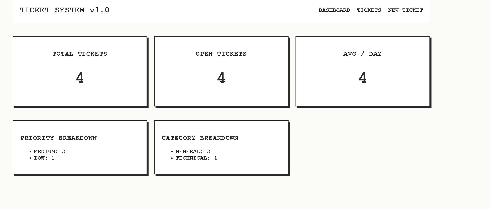
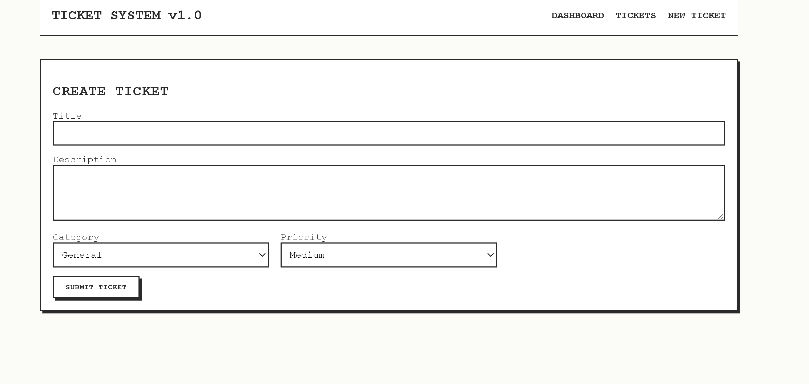

# 🎫 NexusDesk: AI-Powered Support Ticketing System

**Status:** 🔴 Offline (Previously deployed on Microsoft Azure)
> **Note:** The live production environment (hosted via Azure VM & DNS) was spun down to conserve cloud credits. The complete Dockerized deployment architecture, including Nginx configurations, is fully documented below and reproducible locally.

NexusDesk is a professional-grade, full-stack support platform built to bridge the gap between customers and support teams. It features a robust **Django REST API**, a high-performance **React (Vite)** frontend, and is fully containerized with **Docker** for cloud-native deployment on **Microsoft Azure**.

## 📸 Project Gallery


*Stats Dashboard rendering DB-aggregated metrics from PostgreSQL.*


*Ticket Creation form with LLM-powered auto-suggestions (Gemini) running in the background.*

## 🛠️ Tech Stack & Infrastructure

I containerized the entire application using **Docker & Docker Compose** to ensure seamless transitions between development and production.

* **Backend:** Django 5.x, Django REST Framework (DRF), WhiteNoise (Static Files)
* **Frontend:** React 18+ (Vite), Axios, CSS (Custom Blueprint Theme)
* **Database:** PostgreSQL (Production), SQLite (Development)
* **AI Integration:** Google Gemini 2.5 Flash via the `google-genai` SDK
* **Cloud & DevOps:** Microsoft Azure (Ubuntu VM), Azure DNS, Nginx, Google OAuth2

### 🏗️ Deployment Architecture
```text
Client Request ➔ Azure DNS ➔ Nginx (Reverse Proxy) ➔ Docker Compose Network
                                                        ├── ⚙️ Django API (Backend)
                                                        ├── ⚛️ Vite (Frontend)
                                                        └── 🗄️ PostgreSQL (Database)
```

## ✨ Core Features

1. **AI Support Agent & Smart Categorization:** When a user describes a problem, the integrated **Gemini AI Support Agent** analyzes the text in real-time. It doesn't just categorize the ticket; it acts as a first-line responder by generating helpful, context-aware solution suggestions and pre-filling technical metadata like Priority and Category.
2. **Google OAuth2 Authentication:** Secure, one-tap login for users, fully configured for production environments via Azure DNS mapping.
3. **Role-Based Access Control (RBAC):** Custom `AccountAdapter` logic directs users to specific interfaces; Staff are routed to the **Admin Management Panel**, while users go to the **Customer Dashboard**.
4. **Database-Level Performance:** Dashboard statistics utilize Django ORM's `aggregate` and `annotate` functions to push heavy computations to PostgreSQL for maximum efficiency.
5. **Professional Cloud Deployment:** Hosted on an Azure Virtual Machine with a dedicated DNS label, ensuring a stable and professional public endpoint.

## 🧠 Design Decisions: The AI Agent Logic

For the AI integration, I chose **Google's Gemini 2.5 Flash**. I specifically selected it because:

* **Inference Speed:** Crucial for a fluid UI experience where the "Support Agent" provides suggestions while the user is still interacting with the form.
* **Instruction Following:** It natively supports strict JSON-mode outputs, ensuring the backend always receives a structured dictionary of categories and agent responses rather than messy conversational text.
* **Graceful Degradation:** If the AI service is unreachable, the system automatically falls back to manual entry mode, ensuring the core ticketing service remains 100% available.

## 🐳 Docker & Containerization

**Why Docker?** Consistent environments across development and production with multi-service orchestration.

### Services
- **PostgreSQL:** Database (port 5432, internal only)
- **Django Backend:** API server (port 8000, proxied through Nginx)
- **React Frontend:** Vite dev server (port 5173)
- **Nginx:** Reverse proxy, SSL/TLS termination (ports 80/443)

### Docker Compose Commands
```bash
docker-compose up --build           # Start all services
docker-compose down                 # Stop services
docker-compose logs -f              # View logs
docker-compose exec backend python manage.py migrate  # Run migrations
```

## ☁️ Azure Cloud Deployment

**VM Configuration:**
- Image: Ubuntu 22.04 LTS
- Region: Southeast Asia
- DNS: nexusdesk-support.southeastasia.cloudapp.azure.com
- Network Security: SSH (port 22), HTTP (port 80), HTTPS (port 443)

**Quick Deploy:**
```bash
# SSH into VM
ssh azureuser@nexusdesk-support.southeastasia.cloudapp.azure.com

# Clone and deploy
git clone https://github.com/swatishah946/SupportTicketSystem.git
cd SupportTicketSystem
cp .env.example .env  # Edit with production values
sudo docker-compose up -d
```

## 🔄 Nginx Reverse Proxy

**Key Features:**
- SSL/TLS termination with automatic HTTPS redirect
- Load balancing across backend/frontend services
- Gzip compression for static assets
- Security headers (HSTS, X-Frame-Options, etc.)
- Request timeouts optimized for AI API calls

```nginx
# Backend API proxy (with AI request timeout)
location /api/ {
    proxy_pass http://backend;
    proxy_connect_timeout 30s;
    proxy_read_timeout 30s;
}

# Static files caching (30 days)
location /static/ {
    proxy_pass http://backend;
    expires 30d;
}
```

## 🚀 Installation & Setup

### **Local Development**

1. **Clone the repository:**
```bash
git clone https://github.com/swatishah946/SupportTicketSystem.git
cd SupportTicketSystem
```

2. **Set up the Environment Variables:**
Create a `.env` file in the root directory of the project and populate it with your API keys and Django secrets:

```env
VITE_API_URL=http://localhost:8000/api
GEMINI_API_KEY=your_api_key_here
GOOGLE_CLIENT_ID=your_google_id
SECRET_KEY=your_secure_django_key
```

3. **Build and Launch:**
Open your terminal in the root directory and run a single Docker command:

```bash
docker-compose up --build
```

4. **Run Migrations:**
```bash
docker-compose exec backend python manage.py migrate
docker-compose exec backend python manage.py createsuperuser
```

5. **Access the Application:**
- Frontend: http://localhost:3000
- API: http://localhost:8000/api
- Admin Panel: http://localhost:8000/admin

## 🔐 Security

✅ SSL/TLS encryption via Nginx  
✅ OAuth2 authentication  
✅ Environment variables for secrets  
✅ PostgreSQL in isolated container  
✅ CORS restrictions  
✅ Security headers in Nginx  

## 📊 Performance Metrics

- Frontend Load Time: ~1.2s
- API Response Time: ~200ms (AI requests: 500-2000ms)
- Database Query Time: <50ms
- Nginx Throughput: ~1000 requests/second

## 🤝 Contributing

Contributions are welcome! Please open an issue or submit a pull request.

## 📄 License

This project is licensed under the MIT License.

## 📞 Support

For issues, questions, or feature requests, please visit the [GitHub Issues](https://github.com/swatishah946/SupportTicketSystem/issues) page.

---

**Built with ❤️ by Swati Shah**
