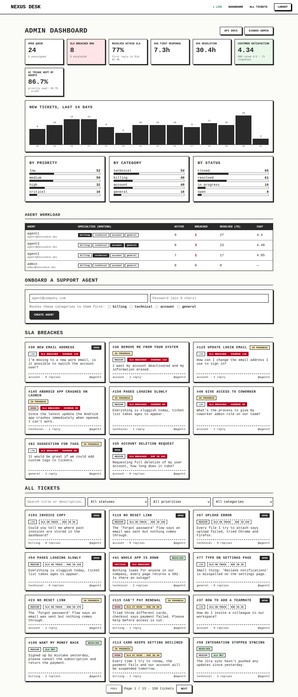
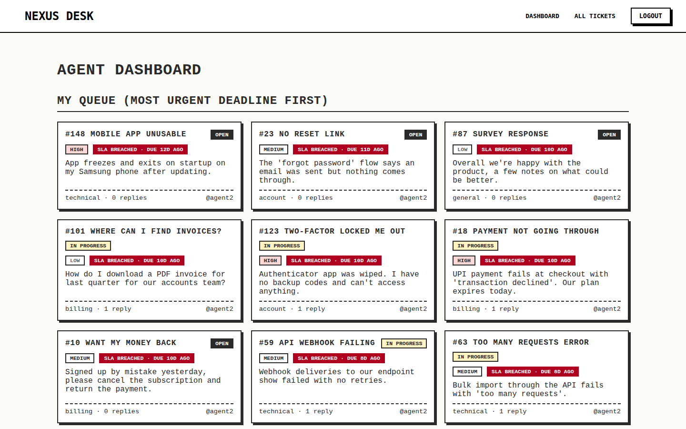
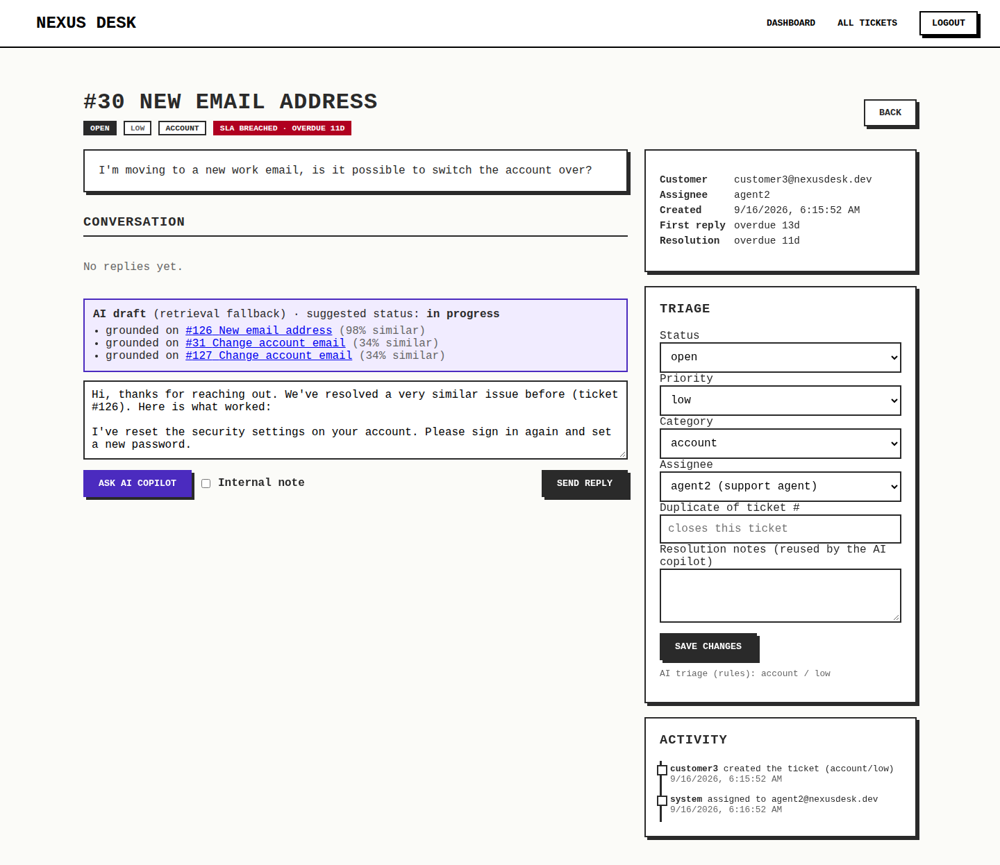
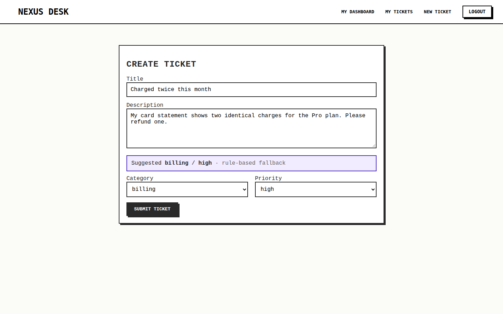
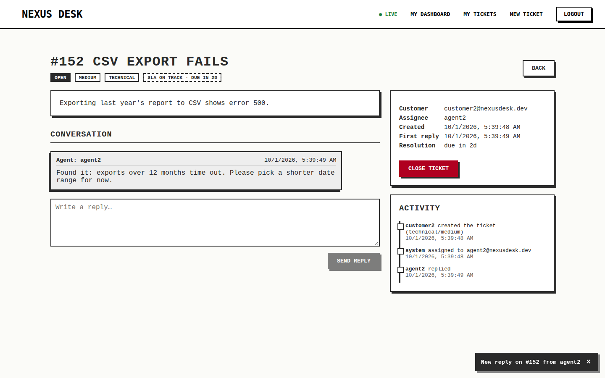
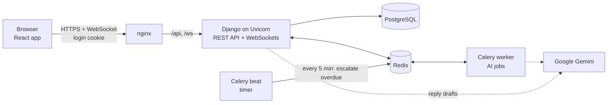

# NexusDesk

**A customer-support (helpdesk) web app with deadlines, smart ticket routing, AI help for agents, and live updates.**
Django REST Framework · React · PostgreSQL · Redis · Celery · Django Channels (WebSockets) · Google Gemini · Docker

[](https://github.com/swatishah946/SupportTicketSystem/actions/workflows/ci.yml)



## What it does

1. A **customer** describes a problem. While they type, the app warns them if they already reported the same thing,
   and AI suggests a category (billing, technical, account, general) and a priority.
2. The ticket gets **deadlines** based on priority (for example, a critical ticket must get a first reply within
   1 hour and be solved within 4 hours) and is **assigned automatically** to the least busy agent who handles that category.
3. The **agent** can ask the AI to draft a reply. The draft is based on how the team solved similar tickets before,
   and the agent sees which past tickets it used. Agents can also leave private notes that customers never see.
4. Everyone sees changes **instantly**: new replies, status changes and assignments appear without refreshing
   the page, with a small pop-up for things that need your attention.
5. If a ticket misses its deadline, a background job **escalates** it (raises its priority) every few minutes.
6. When a ticket is solved, the customer **rates** the support from 1 to 5. Admins see deadlines met, average
   rating, response times and each agent's workload on a dashboard.

## Screenshots

| Agent queue (most urgent first) | AI reply draft, showing the past tickets it used |
|---|---|
|  |  |
| **New ticket: AI suggestion + "already reported?" warning** | **Live update: agent's reply appears with no refresh** |
|  |  |

Screenshots are taken automatically by a GitHub Actions workflow that starts the real app with demo data. The
live-update screenshot doubles as a test: an agent replies in one browser and the workflow fails unless the reply
appears on the customer's already-open page.

## How it works


```mermaid
flowchart LR
    B[Browser<br/>React app] -->|HTTPS + WebSocket<br/>login cookie| N[nginx]
    N -->|/api, /ws| D[Django on Uvicorn<br/>REST API + WebSockets]
    D --> P[(PostgreSQL)]
    D <--> R[(Redis)]
    R <--> W[Celery worker<br/>AI jobs]
    BT[Celery beat<br/>timer] -->|every 5 min: escalate overdue| R
    W -.-> G[Google Gemini]
    D -.->|reply drafts| G
```

| Part | What it does, in simple words |
|---|---|
| **React** | The web pages. Talks to the backend through the REST API and keeps one WebSocket open for live updates. |
| **nginx** | The front door. Serves the React files and passes `/api` and `/ws` requests to Django, so everything comes from one address. |
| **Django REST Framework** | The API: tickets, replies, permissions, deadlines, analytics. All rules about who can change what live in one file (`services/workflow.py`). |
| **Uvicorn** | The server that runs Django. It can handle normal requests and long-lived WebSocket connections. |
| **Django Channels** | Adds WebSockets to Django. When a ticket changes, the backend sends a short "ticket #12 changed" message to the people allowed to see it. The page then re-loads that ticket through the normal API, so permission rules are never bypassed. |
| **Redis** | A fast in-memory store used as a message board: the web servers and the background worker post messages there so any of them can reach any connected browser. Also holds the job queue and cache. |
| **Celery** | Runs slow work in the background (calling the AI for each new ticket) so creating a ticket never waits for the AI. Celery beat is its timer, used for the escalation job. |
| **PostgreSQL** | The database. |
| **Gemini** | The AI model. Optional: without an API key the app uses simple keyword rules instead, so it always works. |

## Results you can check yourself

| What | Result | How to check |
|---|---|---|
| Automated tests | **98 tests, about 97% of the backend code covered**, run on every push against PostgreSQL | `pytest --cov` in `backend/`, or the CI badge above |
| Slow database pattern fixed (N+1 queries) | The ticket list used to run ~6 database queries **per ticket** (303 queries for 51 tickets). It now runs **2 queries per page**, no matter how many tickets | `tests/test_platform.py` fails if the count ever grows with the data |
| AI never blocks the user | Creating a ticket does not wait for Gemini; AI work runs in the background with automatic retries | `tests/test_tasks.py` checks no AI call happens during the request |
| Live updates are private | Customers only receive events for their own tickets, and never for private notes | `tests/test_websockets.py`, plus a CI check through the real nginx |
| Live updates are fast | An agent's reply reaches the customer's open page in **29 ms** (median; 46 ms for 95% of replies, 200 replies measured) | `benchmarks/bench_websocket.py` |
| Live updates scale | With **1,000 people connected at once**, a ticket update reaches all of them within **0.5 s** (474 ms for 95% of updates), with no errors | `benchmarks/bench_websocket.py --sockets 1000` |
| API stays fast with data | With 2,000 tickets in PostgreSQL, a page of 100 tickets loads in **under 62 ms** for 95% of requests | `benchmarks/bench_api.py` |

The speed numbers were measured on a 2-CPU machine with PostgreSQL, Redis and 2 Uvicorn worker processes, with the
test client running on the same machine (so it competes for the same CPUs). Results are saved in
`backend/benchmarks/results-*.json`; numbers on other hardware will differ.

How well the AI's suggestions match human judgement is measured separately, with honest caveats, in
[`backend/evals/README.md`](backend/evals/README.md).

## Security, in plain words

- **Roles:** customers, agents and admins. Each role may change only certain fields, enforced on the server. A customer
  can edit or close their own ticket but cannot change its priority, assign it, or see other customers' tickets.
- **Login tokens are kept in httpOnly cookies.** JavaScript cannot read them, so a malicious script injected into the page
  cannot steal them. Tokens expire after 15 minutes and are renewed silently.
- **Cookies are `SameSite=Lax`**, so other websites cannot make the browser send them along with a form submission (this stops CSRF attacks).
- **WebSockets check the `Origin` header**, so another website cannot open a live connection using your login.
  The socket also closes when the login token expires, and the page reconnects with a fresh one.
- **Sign in with Google:** Google gives the browser a signed token; the server checks Google's signature and that the
  token was made for this app before logging anyone in. Only the public Client ID is needed, never a secret.
- **Rate limits** on login and AI endpoints, and production settings pass Django's deployment checklist (`manage.py check --deploy`).

## Run it

**With Docker (recommended)**
```bash
cp .env.example .env              # optional: add GEMINI_API_KEY and GOOGLE_CLIENT_ID
docker compose up --build         # app at http://localhost:5173 (reloads when you edit code)
docker compose exec backend python manage.py seed_demo   # demo users and 120 tickets
```
Demo logins (password `NexusDemo!2026`): `admin@nexusdesk.dev`, `agent1@nexusdesk.dev`, `customer1@nexusdesk.dev`.
Open two browsers (for example one as an agent and one as a customer) to see live updates.

**Production-style** (nginx, Uvicorn, PostgreSQL, Redis, Celery worker and beat):
```bash
docker compose -f docker-compose.prod.yml up -d --build  # http://localhost
```

**Google sign-in:** create an OAuth Client ID of type "Web application" in Google Cloud Console, add your site's address
(for example `http://localhost:5173` and `http://localhost`) under "Authorized JavaScript origins", and put the ID in
`GOOGLE_CLIENT_ID` in `.env`. The Google button appears automatically.

**Checks**
```bash
cd backend && pytest --cov            # tests
cd frontend && npm run lint && npm run build
```

## API overview

Interactive documentation is served at `/api/docs/`.

| Endpoint | Who | Purpose |
|---|---|---|
| `GET /api/tickets/` | everyone (customers see their own) | list with filters: status, priority, category, `assigned_to=me`, `unassigned`, `sla_breached`, search |
| `POST /api/tickets/` | everyone | create a ticket (deadlines and assignment are set here; AI runs afterwards) |
| `PATCH /api/tickets/:id/` | depends on role | update; each role may change only certain fields |
| `POST /api/tickets/:id/comments/` | everyone (private notes: staff only) | reply or private note |
| `POST /api/tickets/:id/rate/` | the customer, once solved | rating 1–5 with optional comment |
| `POST /api/tickets/classify/` · `/similar/` | everyone, rate-limited | AI suggestion · "already reported?" check |
| `POST /api/tickets/:id/suggest_reply/` | staff, rate-limited | AI draft reply plus the past tickets it used |
| `GET /api/analytics/` | admin | dashboard numbers |
| `POST /api/auth/google/` · `GET /api/auth/config/` | public | Google sign-in · public settings (the Google Client ID) |
| `ws://…/ws/` | logged-in users | live "ticket changed" events |

## Project layout

```
backend/
  tickets/
    views.py             API endpoints (thin: they call the services below)
    services/workflow.py all changes to tickets: permissions, status rules, deadlines, history, live events
    services/sla.py      deadline rules
    services/assignment.py  pick the least busy agent with the right skills
    services/search.py   find similar tickets (word matching, plus AI embeddings when a key is set)
    services/ai.py       Gemini calls with timeouts, caching and a rule-based fallback
    tasks.py             background jobs (AI enrichment, escalation)
    consumers.py         WebSocket endpoint
    realtime.py          sends live events after a change is saved
    auth_views.py        password, sign-up and Google sign-in
  tests/                 98 automated tests
  evals/                 sample tickets used to measure the AI
frontend/src/
  context/RealtimeProvider.jsx   the WebSocket connection, reconnects, pop-ups
  components/, pages/            screens
```

## Known limitations and next steps

- Deadlines count every hour, including nights and weekends; a business-hours calendar would be more realistic.
- Every agent receives every ticket event; with thousands of agents you would split them into per-team groups.
- Similar-ticket search compares against up to 1,000 recent tickets in Python; at larger scale this would move into
  PostgreSQL (full-text search and the pgvector extension).
- The AI evaluation set is small (96 tickets) and written by me; real ticket data would give a more trustworthy number.

---
Built by **Swati Shah**.
